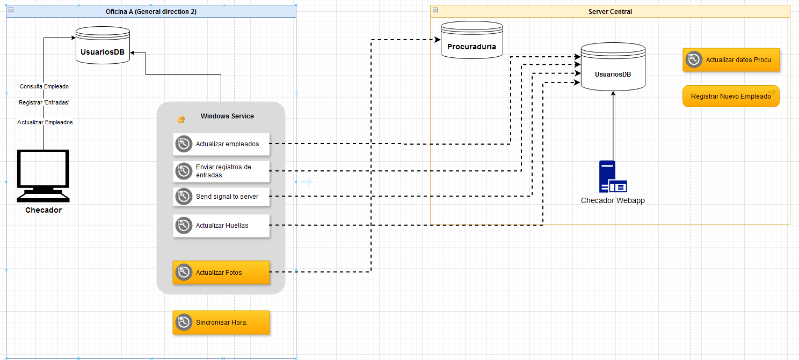

# Project Overview
**Project Name**: Checador. 
**Description**: This project consists of a Windows Forms application and a Windows Service.
The Windows Forms app provides a graphical interface for users, while the Windows Service runs in the background to syncrinices the data with the remote server.

### Technology Stack:
 - .NET Framework 4.7.5
 - C#
 - SQL Server Expres 2019
 - Windows Forms
 - Windows Services
 
# System Architecture

## Components

### Windows Forms Application
- Provides the user interface.
- Interacts with the local MSSQL Database via [SQL Client](https://learn.microsoft.com/es-es/sql/connect/ado-net/introduction-microsoft-data-sqlclient-namespace?view=sql-server-ver16) fo retrive the employees data and register the checkins, also update the fingerprint of the employee.

### Windows Service
Runs some processes in the background to maintain data synchronization between the local and remote databases. The processes include:
- **Update the employees**: Every 3 hour downloads employee data from the server and saves it into the local database.
- **Send check-ins**: Every minute sends employee check-ins to the server. Upon successful transfer, the check-ins are moved from the original table to a history table.
- **Send signal**: Sends a signal every minute to the server to verify if the local machine has a connection with the remote server.
- **Update fingerprints**: The Windows Forms app allows fingerprint updates for employees. This task checks if any employee has an updated fingerprint by comparing timestamps in the employee records. If an update exists, it is sent to the server, this is done every 6 hours.

This task are builded using the library [Quartz.NET](https://www.quartz-scheduler.net/) for making scheduling jobs. 
The windows service is builded using the library [TopShelf](https://www.nuget.org/packages/Topshelf/4.3.1-develop.253).

# Installation & Setup
This project uses [Inno Setup](https://jrsoftware.org/isinfo.php) for making the installation file, in the folder 'resources/installation' you can find the script named **'checador-installer-script.iss'** for making the installation file, its necessary update the variable **'ProyectPath'** with the correct path depens on your project path.

## Prerequisites
- Windows OS
- .NET Runtime 4.7+
- SQL Server 2019 +

# Logging Mechanism
### Windows Forms
The Windows Form uses Windows Event Log for loggin with the **LogName : 'DGTIT'** and the **LogSource : 'Checador3'**, you can use the [windows event viewer](https://learn.microsoft.com/es-es/shows/inside/event-viewer) for view the logs.
### Windows Service
The Windows Service use a file mechanism for loggin, the default path where this logs are saved is 'C:\ProgramData\DGTIT\Checador\logs\'.